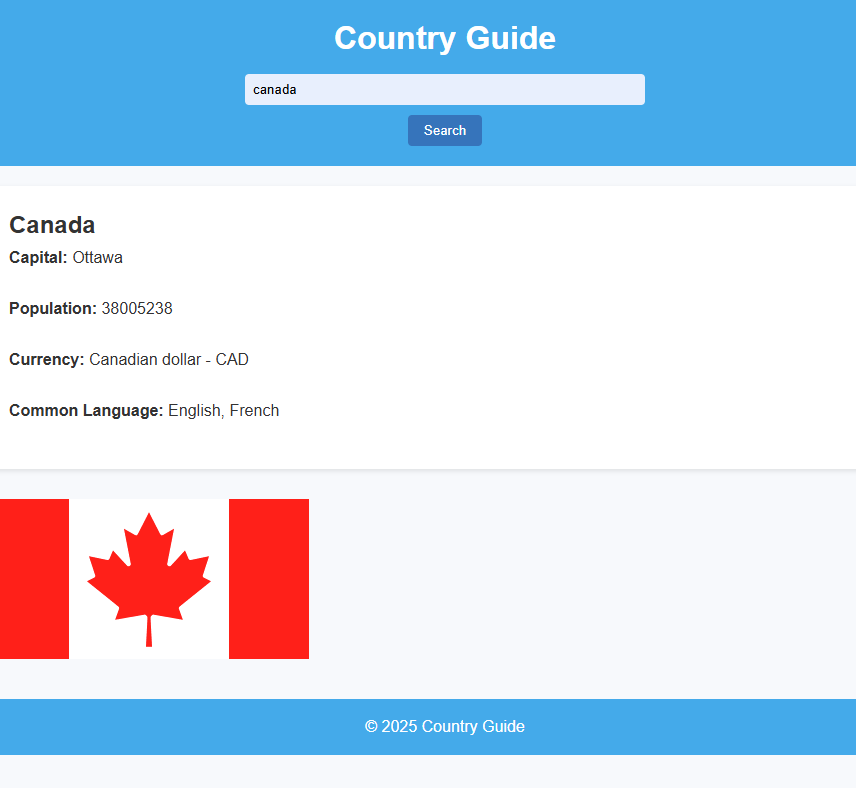

# Country Guide

A small, static web app that displays country information. Built with vanilla JavaScript, HTML and CSS, this project is ideal for learning DOM manipulation, responsive layout, and simple client-side interactions.

## Features

- Responsive single-page layout
- Interactive UI behavior driven by `app.js`
- Minimal and clean styling for quick customization
- Fetches real country data from a public API such as REST Countries (https://restcountries.com/) to make the guide dynamic.

## Project structure

- `index.html` — main page and markup
- `style.css` — styles and responsive rules
- `app.js` — JavaScript to handle UI behavior and interactions
- `country-guide.png` — project image/thumbnail

## How to run

1. Clone or download the repository.
2. Open `index.html` in your browser (double-click or use "Open with" in your editor). No server or install is required because the app is static.

## Usage

- Explore the page content and any interactive elements implemented in `app.js`.
- Edit `style.css` to tweak the look and responsiveness.
- Extend `app.js` to add dynamic behaviors or features.

## License & Author

Provided as-is for learning and experimentation.

Author: BeterMain
Idea inspired from Coding Artist
